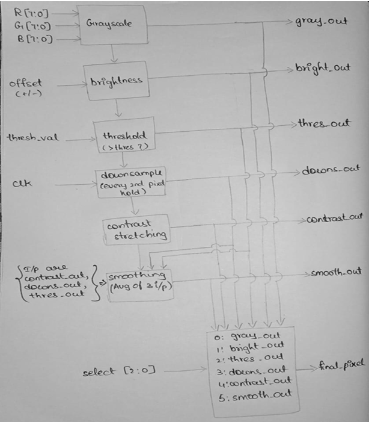
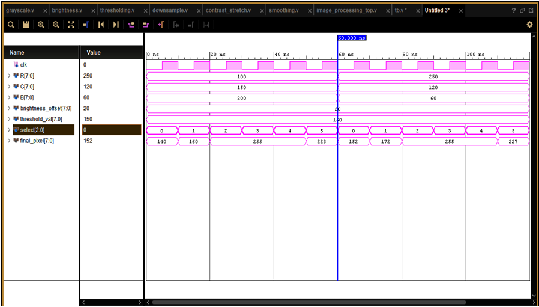

# FPGA-Based Image Processing Pipeline (Verilog HDL)

## Overview
This project implements a modular image processing pipeline using Verilog HDL.
The design demonstrates fundamental pixel-level operations that are essential
in real-time vision systems and can be extended for more advanced FPGA-based
image processing applications.

## Features
The pipeline includes the following modules:
- Grayscale conversion
- Brightness adjustment with saturation handling
- Thresholding
- Downsampling
- Contrast stretching
- Smoothing filter

## Architecture
Each operation is implemented as a separate RTL module. A top-level
pipelined design connects these modules and allows dynamic testing of
intermediate results using a control signal.

## Tools & Verification
- **Language:** Verilog HDL  
- **Simulation:** ModelSim / Vivado  
- Verified using testbenches and waveform analysis to ensure correct logic
  behavior and saturation limits.

## Results
Simulation waveform and pixel-level validation confirm that each module
behaves as expected, with correct data propagation and value ranges.

## Applications
- FPGA-based preprocessing for image enhancement
- Embedded vision systems (medical, surveillance, robotics)
- Real-time hardware image pipelines

## Limitations
- Single-pixel processing without frame buffering
- No spatial convolution kernels or pattern detection

## Future Improvements
- Frame buffering using line buffers or block RAM
- Edge detection, convolution filters
- Porting to Xilinx Zynq SoC with real sensor interfaces
